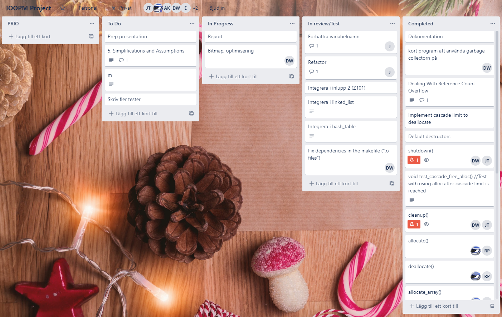
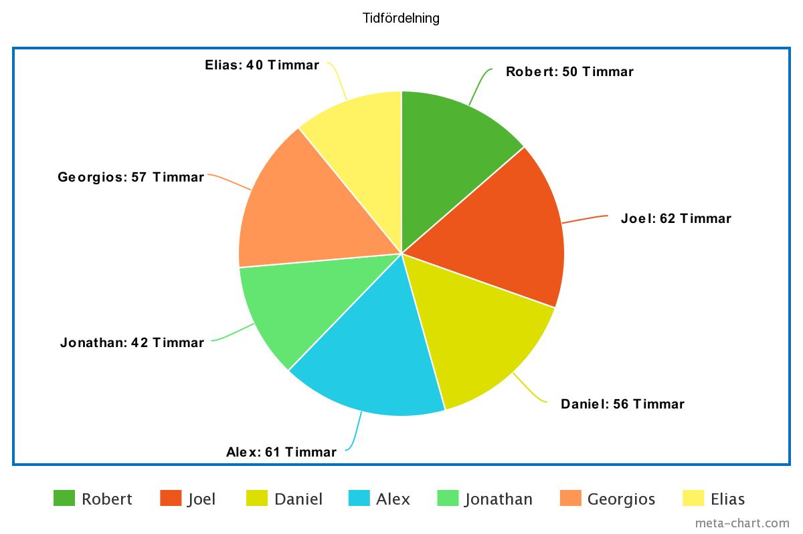
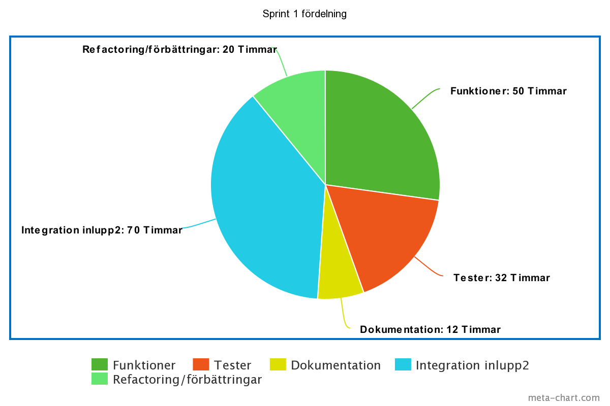
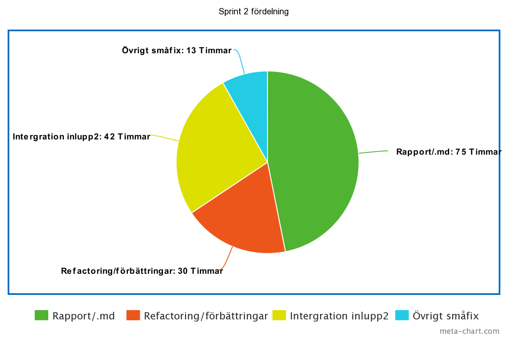

Manuel minneshantering i C
==========================

OBS: Detta var först skrivet i latex, vilket också är medskickat i denna mapp som Projek_IOOPM.pdf

Process
-------

#Påbörjande
Den utvecklingsprocess som valdes under detta projekt var KANBAN,
vilket är ett visuellt system där processen enkelt kan efterföljas med en tavla från start till slut.

Valet av utvecklingsprocess skedde genom jämförelse av arbetssättens styrkor och svagheter. De processer som jämfördes var SCRUM och KANBAN,
eftersom KANBAN kändes mer intuitiv valdes denna.
Utvecklingprocessen implementerades med hjälp av Trello, vilket är ett program som förhåller sig väldigt bra till KANBANs arbetssätt.
Med Trello kan en virtuell tavla skapas, som alla i gruppen sedan har tillgång till.
Mycket av Trellos funktionalitet underlättade dessutom utvecklingsprocessen, då det var enkelt att bl.a.

* skapa helt nya steg i processen
  * lägga till nya kort (saker att göra)
  * flytta på saker under processen
  * följa specifika kort under arbetet etc.

##Genomförande

Närmare var anledningen till att KANBAN valdes som arbetsprocess densamma som processens styrkor.
Med hjälp av KANBAN var det enkelt att konkret bestämma vad som måste göras, samtidigt som var lätt att se vad som är kvar.
Då alla arbetssteg är så konkreta blev uppdelning och planering av arbetet dessutom mycket lättare.
Utöver detta begränsade KANBAN pågående arbete då endast det viktigaste som måste implementeras/göras lades till på tavlan,
vilket ledde till att de väsentligaste sakerna blev klara först. 

Den enda nackdelen som märktes med arbetsprocessen var att det inte finns en riktig tidsram associerad med varje steg och vad som görs i varje steg,
vilket ledde till att tidsramarna hela tiden behövdes omvärderas. Då det fanns gott om tid för projektet var detta dock inte ett stort problem.

Detta projekt var uppdelat i 2 sprintar, där den första sprinten var planerad att vara delen där implementationen av projektet blev klar, medan den andra sprinten skulle vara ett tillfälle för att skriva rapporten och förbereda seminariet för projektet. Vid slutet av sprint 1 hade majoriteten av projektet blivit implementerat, men det fanns fortfarande mycket kvar. De oklara tidsramarna av KANBAN ledde till att planeringen inte kunde fullföljas helt och hållet. Som sagt fanns det tillräckligt med tid under projekt, så implementationen kunde avslutas under sprint 2 tillsammans med semniareförberedelsen och rapportskrivningen, men om deadline hade varit satt tidigare skulle detta lett till problem.  
Om detta projekt upprepades med samma utvecklingssätt skulle tidsplaneringen för projektet vara mer pessimistisk för att lättare möta deadline. Det skulle vara bättre att anta att projektet skulle ta mer tid och bli klar inom tidsramen, än att bli klar efter eller precis vid tidramens slut. 
Utöver detta gick KANBAN processen väldigt smidigt, och alla styrkor KANBAN lovade märktes väldigt tydligt, så implementationen av processen skulle vara densamma om projektet upprepades.    

Även trots att uppdelningen av sprintarna inte var felfri fungerade det väldigt bra. Dessa var uppdelade så att sprint 1 var från projektets början till innan jullovet, medan den andra sprinten började efter jullovet vilket ledde till en väldigt naturlig uppdelning av sprintarna. Som sagt var sprint 1 planerad för implementation medan sprint 2 var planerad för efterarbetet, men sprint 1 flöt ihop i sprint 2. Dock följdes planen mestadels, där majoriteten av implementationen som sagt skedde under sprint 1 och det resterande under sprint 2. Den underliggande planen följdes då alltså hela vägen, med justeringen att en del av sprint 1 gjordes under sprint 2.

Användning av verktyg
---------------------

Under projektets gång använde vi en hel del olika verktyg. Som editor använde vi alla emacs, eftersom det är det vi har fått lära oss under kursen. För att kontrollera minnesläckor har vi använt valgrind för att verifiera att vårt program faktiskt är felfritt. För att testa programmet använde vi oss av Cunit, åter igen för att det har vi lärt oss under kursen. Vi har verifierat att testerna täcker de flesta fallen med gcov/lcov. Make har använts för att bygga programmet och köra diverse olika verktyg som valgrind, lcov, gprof osv.  
Git tillsammans med Github har använts som versionskontroll, det har varit väldigt användbart och smidigt då vi kunnat göra pull requests och låta varandra läsa igenom koden man skrivit. För arbetsuppdelning har vi använt trello (se figur trello), ett program som med fördel kan användas när man arbetar efter KANBANs arbetssätt. Vi har använt Slack för kommunikation, vilket har varit smidigt då den finns som en app till mobilen. 
Verktygen har varit till stor nytta och underlättat projektet, det är inget vi känner som saknas och inget vi känner som har varit onödigt.
%In this section, discuss:

Kommunikation och Samarbete
--------------------------

Under projektets gång använde sig gruppmedlemmarna främst av programmet/applikationen Slack för att kommunicera. En gruppchatt fanns där medlemmarna kunde förmedla bl.a relevant information om projektet, mötesplats och dylikt. Viss kommunikation skedde även via GitHub och Trello, men i de fallen var det främst för att underlätta förståelsen i en specifik del av projektet och inte som ett direkt meddelande till gruppen. Kommunikation med personer utanför gruppen, som t.ex. gruppens coach, skedde via e-mail. Kommunikationen i gruppen var inte optimal vid alla tillfällen - t.ex. kunde det ibland vara oklart när och var man skulle ses - men den var oftast tillräckligt bra för leda projektet framåt. Den oklarhet som kunde uppstå ibland kan bero på att det inte fanns några bestämda roller i gruppen. När en person har en roll eller ett ansvarsområde brukar denne oftast ha lättare för att ta beslut och därför också lättare för att uttrycka sin åsikt. Under lovet var kommunikationen inte så bra, men i och med att gruppen hade bestämt att jobba i två sprintar - före och efter lovet - så var det väntat.
 
I början tilldelades alla en kodpartner och tanken var att kodparen skulle kunna jobba oberoende från varandra i moduler utifrån de funktioner som var angivna i projektinstruktionerna. Kodparen hölls i början och fungerade ganska bra, men det märktes tidigt att vissa av funktionerna var svårare än andra och att det underlättade att ha flera av de i samma fil. Detta gjorde att arbetet började ske i större grupper, ofta i klassrum för att kunna använda medel som tavlor och storbildskärm. Användningen av tavlor och storbildskärm gjorde det lättare för alla i gruppen att förstå projektet och den kod som skrevs, men nackdelen kunde ibland bli att för stor uppmärksamhet riktades åt den kod som skrevs på storbildskärmen när den istället kunde ha riktats åt ens egna arbete.
 
Det hölls en god stämning i gruppen. Samtliga gruppmedlemmar var samarbetsvilliga och delaktiga under hela projektet. Konflikter som uppstod - t.ex olika åsikter om algoritmer, tillvägagång och liknande - löstes utan större problem. Det var ingen som var negativ eller verkade uppgiven. Den stress som kunde uppstå försvann ofta relativt snabbt i och med att alla jobbade på bra.
 
Det som har lärts under projektet är att kommunikation är a och o. Vi hade aldrig kunnat styra upp detta projekt utan att prata med varandra. Samarbetet och kommunikationen hjälpte också alla att förstå vad vi hade gjort i diverse funktioner och annat.

Arbetsstruktur
--------------

Under projektet var de faktiska uppgifterna: 
  * planering av projektet 
  * implementation av kanban
  * implementation av projektet
  * rapportskrivning
  * seminareförberedelse

Då den arbetsprocess som användes var KANBAN var uppdelningen av arbetet väldigt enkelt. Allt som behövdes göras lades upp som kort, där sedan alla i gruppen enkelt kunde välja ett att arbeta med. Det mer svåra jobbade flera tillsammans på med hjälp av en projektor, medan resten valde kort att jobba på. I denna grupp jobbade varje individ på vad de ville, men det fungerade bra då alla var involverade och försökte bidra till gruppen, samtidigt som kommunikationen mellan medlemmarna var väldigt tydlig. Alla problem med svårigheter och arbetsbörda löstes med kommunikation och vidare fördelning/hjälp.  

Tidsuppskattning under ett längre projekt likt detta har varit en av de svåraste delarna. Den främsta lärdomen som dragits är att det ofta tar längre tid än uppskattat, och att det är viktig att ta hänsyn till detta. 

Kvalitetsgranskning
-------------------

Bl.a. är vi säkra på att rätt saker implementerades genom att konsultera handledaren till vår grupp, samtidigt som vi följde instruktioner och gjorde tester utifrån dem.

Alla enskilda delar i programmet testades först i isolation med egna tester, för att sedan testa dessa delar tillsammans i inlupp 2. Vid varje pull-request testades sedan enhetstesterna automatiskt. Alla tester skrevs precis när en funktion var skriven, för att direkt kunna testa dem. De som skrev funktionerna skrev därefter testerna till dem. 

När funktionalitet var skriven och färdigtestad gjordes en pull request för att uppdatera helheten. Sammanlagt gjordes 50 pull requests i master-branchen, av samtliga medlemmar. Alla pull requests behövde godkännas av minst en annan person i gruppen. Totalt skrevs 13 kommentarer på pull requests. Anledningen till att det blev så få kommentarer var att vi ofta satt tillsammans.

Vi försökte att använda pull requests så seriöst som möjligt, vilket ledde till att vi alltid kunde testa nya implementationer innan vi pushade till master-branchen. Dock behövdes inte alltid en noggrann granskning göras eftersom vi jobbade så tätt ändå.

Ibland skrevs bara namnet på den som gjorde en pull request, vilket inte gav tillräckligt tydlig information om vad den handlade om. Ett exempel på bra namn för pull request kan vara: Fix for listsize, tests no longer need listnegate().

Allt som allt har vi fått en djupare förståense för hur pull requests kan bidra till projektutveckling.

Reflektion
----------
Vår tillfredsställelse med den valda processen är 6/7, då den var väldigt tydligt upplagd och följdes enligt plan. Använde som tidigare nämnt KANBAN, och delade upp projektet i 2 sprintar, och alla dessa val ledde till att utvecklingsprocessen var väldigt smidig, enligt det nämnt under \textit(Process).

Tillfredsställelsen med vårt minneshanteringssytem är 6/7. Det finns fortfarande några få buggar att lösa, vilka vi känner att vi skulle löst med lite mer tid. Produkten som helhet fungerar annars precis som planerat.  

Tillfredsställelsen med kvalitetsgranskningen är 5/7, då vi aktivt använde pull request och granskning av varandras kod. Pull requests skulle dock kunnat användas lite mer aktivt.

Den största vinsten i gruppen var vår kommunikation. Alla i gruppen var duktiga på att konstant uppdatera varandra, vilket är någonting alla i gruppen har tagit lärdom av.

Gruppen planerade att ha kodpar i början av projektet, vilket föll samman ganska snabbt. Sättet vi jobbade på efter det fungerade väldigt bra, men vi tror att projektet snabbare skulle blivit färdigt om vi fortsatte jobba på detta sätt.
 
Tack för oss!
